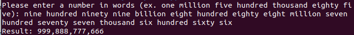

# ConvertWordsToNumber
Convert words to number

Ex. one million two hundred thirty four thousand five hundred sixty seven -> 1,234,567

1. Run from source using the following commands:
  `dotnet run`
2. Compile and run using the following commands:
  `dotnet build`
  `dotnet bin/Debug/[framework]/[binary name]`
  
  
